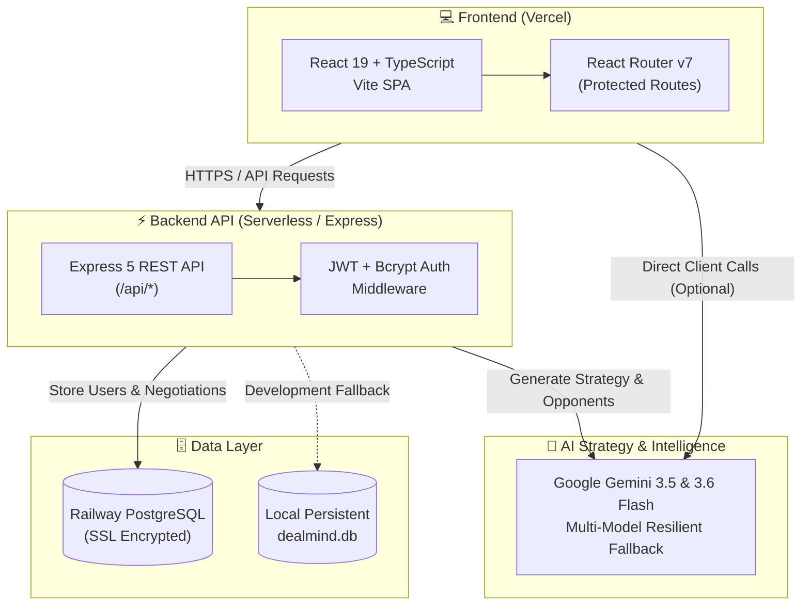
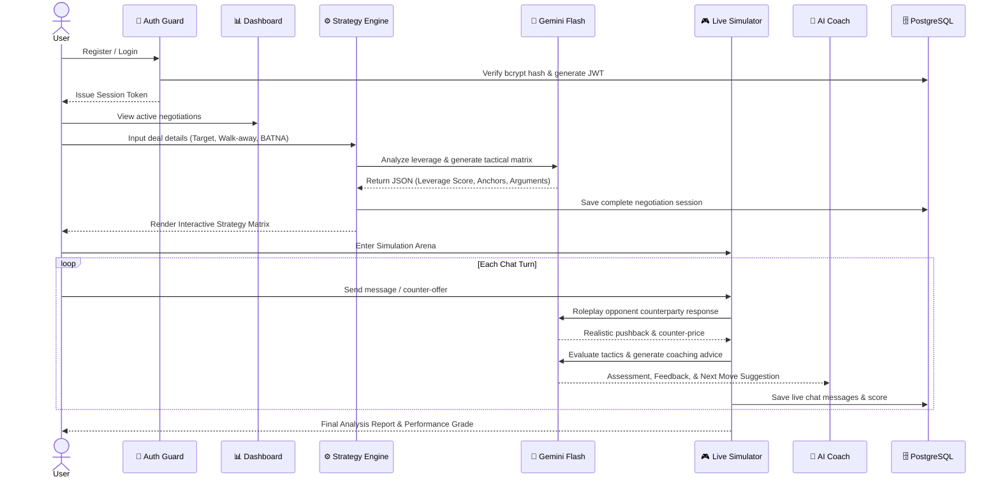

<div align="center">

```
╔══════════════════════════════════════════════════════════════════════╗
║                                                                      ║
║    ██████╗ ███████╗ █████╗ ██╗     ███╗   ███╗██╗███╗   ██╗██████╗  ║
║    ██╔══██╗██╔════╝██╔══██╗██║     ████╗ ████║██║████╗  ██║██╔══██╗ ║
║    ██║  ██║█████╗  ███████║██║     ██╔████╔██║██║██╔██╗ ██║██║  ██║ ║
║    ██║  ██║██╔══╝  ██╔══██║██║     ██║╚██╔╝██║██║██║╚██╗██║██║  ██║ ║
║    ██████╔╝███████╗██║  ██║███████╗██║ ╚═╝ ██║██║██║ ╚████║██████╔╝ ║
║    ╚═════╝ ╚══════╝╚═╝  ╚═╝╚══════╝╚═╝     ╚═╝╚═╝╚═╝  ╚═══╝╚═════╝  ║
║                                                                      ║
║            AI Negotiation Strategist & Simulator v2.0               ║
╚══════════════════════════════════════════════════════════════════════╝
```

<p align="center">
  <strong>Master high-stakes negotiations before they happen.</strong><br/>
  Roleplay against adaptive AI counterparties with live tactical coaching,<br/>
  anchor recommendations, game-theory BATNA calculation, and real-time concession tracking.
</p>

<br/>

[](https://dealmind-hazel.vercel.app/)
[](https://react.dev/)
[](https://www.typescriptlang.org/)
[](https://vitejs.dev/)
[](https://ai.google.dev/)
[](https://railway.app/)
[](LICENSE)

<br/>

### 🌐 Live URL: [https://dealmind-hazel.vercel.app/](https://dealmind-hazel.vercel.app/)

<br/>

[🚀 Features](#-key-features) •
[🏗️ Architecture](#-system-architecture) •
[⚡ Quick Start](#-quick-start) •
[☁️ Vercel Deployment](#-deployment-on-vercel) •
[🎯 Scenarios](#-practice-scenarios) •
[⚙️ Configuration](#-configuration)

</div>

---

## 🌟 What is DealMind?

Negotiating a **salary hike**, **apartment lease**, **freelance rate**, or **enterprise contract** is stressful without preparation. Most people concede too early, anchor too low, or crumble under pressure.

**DealMind** bridges that gap. It combines **game theory**, **BATNA calculations**, and **Google Gemini 3.5/3.6 Flash** into a full-stack, intelligent negotiation preparation platform with persistent database storage.

```
                     ┌─────────────────────────────────────────┐
                     │         THE DEALMIND ADVANTAGE          │
                     ├──────────────────┬──────────────────────┤
                     │  BEFORE          │  WITH DEALMIND        │
                     ├──────────────────┼──────────────────────┤
                     │  Gut feeling     │  Data-backed strategy │
                     │  Guess anchors   │  AI-optimized anchors │
                     │  No BATNA        │  Quantified walk-away │
                     │  Unprepared      │  Pre-simulated rounds │
                     │  Single approach │  4 AI persona styles  │
                     │  Lost data       │  Cloud DB persistence │
                     └──────────────────┴──────────────────────┘
```

---

## 🚀 Key Features

| Feature | Description |
| :--- | :--- |
| 🎯 **Strategy Engine** | Calculates opening anchors, target numbers, walk-away limits, and acceptance probabilities using game theory models. |
| 🎭 **Simulation Arena** | Live interactive AI sparring arena with realistic counter-offers, pushbacks, and tactical trade-offs. |
| 🧠 **Real-Time AI Coach** | Micro-coaching on every turn — flags premature concessions, identifies detected tactics, and suggests optimal next moves. |
| 🗄️ **Persistent Cloud Database** | Native support for **Railway PostgreSQL** (with local persistent fallback) to securely isolate user negotiations, chat transcripts, and settings. |
| 🔐 **Strict Authentication** | Secure user registration and login with `bcrypt` password hashing and stateless JWT bearer token verification. |
| ⚡ **1-Click Presets** | Ready-to-run battle-tested scenarios for Salary, Rent, Freelance, and Enterprise SaaS negotiations. |
| 📊 **Analytics Dashboard** | Visual Radar Charts, concession frequency graphs, and historical performance metrics powered by Recharts. |

---

## 🏗️ System Architecture



---

## 🔄 End-to-End User Flow



---

## 🎯 Practice Scenarios

```
  ┌─────────────────────────────────────────────────────────────────────┐
  │                    BUILT-IN NEGOTIATION SCENARIOS                   │
  ├──────┬──────────────────────────────┬──────────────┬───────────────┤
  │  💼  │ Senior Software Engineer     │ Target       │ ₹10.0 LPA     │
  │      │ vs. HR Talent Partner        │ Walk-away    │ ₹9.0 LPA      │
  │      │                              │ Difficulty   │ 🟡 Intermediate│
  ├──────┼──────────────────────────────┼──────────────┼───────────────┤
  │  🏠  │ Apartment Lease Renewal      │ Target       │ ₹28,000/mo    │
  │      │ vs. Property Landlord        │ Walk-away    │ ₹32,000/mo    │
  │      │                              │ Difficulty   │ 🟢 Beginner    │
  ├──────┼──────────────────────────────┼──────────────┼───────────────┤
  │  💻  │ High-Ticket Freelance        │ Target       │ ₹80,000/mo    │
  │      │ vs. Startup Founder          │ Walk-away    │ ₹65,000/mo    │
  │      │                              │ Difficulty   │ 🔴 Advanced    │
  ├──────┼──────────────────────────────┼──────────────┼───────────────┤
  │  🏢  │ Enterprise SaaS Contract     │ Target       │ ₹90,000/yr    │
  │      │ vs. VP of Procurement        │ Walk-away    │ ₹105,000/yr   │
  │      │                              │ Difficulty   │ 🔴 Advanced    │
  └──────┴──────────────────────────────┴──────────────┴───────────────┘
```

---

## 🤖 AI Persona Styles

The AI counterparty can be calibrated to one of four negotiation temperaments:

```
  ┌─────────────────┐  ┌─────────────────┐  ┌─────────────────┐  ┌─────────────────┐
  │  🤝 COLLABORATIVE│  │  💼 PROFESSIONAL │  │  🛡️ FIRM        │  │  ⚔️ AGGRESSIVE  │
  │─────────────────│  │─────────────────│  │─────────────────│  │─────────────────│
  │ Seeks win-win   │  │ Data-driven      │  │ Holds position  │  │ Anchors high    │
  │ Makes concessions│  │ Formal tone     │  │ Minimal give    │  │ Creates urgency │
  │ Best for: Trust │  │ Best for: Corp  │  │ Best for: BATNA │  │ Best for: Stress│
  └─────────────────┘  └─────────────────┘  └─────────────────┘  └─────────────────┘
```

---

## 📁 Project Structure

```
DealMind-/
├── 📂 api/
│   └── index.js                     # Vercel Serverless Function entry point
│
├── 📂 server/
│   ├── db.js                        # Dual-engine DB (Railway PostgreSQL + SQLite fallback)
│   ├── index.js                     # Express API Server (Port 5000)
│   ├── middleware/auth.js           # JWT Bearer Token validation
│   └── routes/
│       ├── auth.js                  # Register, Login, Me endpoints
│       ├── negotiations.js          # CRUD & Cloud Sync endpoints
│       └── settings.js              # User AI & App Preferences
│
├── 📂 src/
│   ├── 📂 contexts/
│   │   ├── AuthContext.tsx          # Database-backed authentication provider
│   │   └── NegotiationContext.tsx   # Per-user isolated negotiations store
│   │
│   ├── 📂 layouts/
│   │   ├── AppLayout.tsx            # Protected sidebar & navigation shell
│   │   └── AppLayout.css
│   │
│   ├── 📂 pages/
│   │   ├── Landing.tsx              # Public homepage (Modern dark UI)
│   │   ├── Login.tsx                # Secure sign-in page
│   │   ├── Register.tsx             # New account registration
│   │   ├── Dashboard.tsx            # Negotiation command center & KPI metrics
│   │   ├── NewNegotiation.tsx       # 5-Step scenario wizard & instant analysis
│   │   ├── StrategyPage.tsx         # AI-generated strategy matrix & BATNA
│   │   ├── SimulatorHub.tsx         # Practice scenario selector
│   │   ├── Simulator.tsx            # Live roleplay chat arena + AI Coach sidebar
│   │   ├── History.tsx              # Past negotiation archive & score review
│   │   ├── Insights.tsx             # Skill radar charts & leverage breakdown
│   │   └── Settings.tsx             # Gemini API key & opponent preference controls
│   │
│   ├── 📂 services/
│   │   ├── aiService.ts             # Gemini 3.5 & 3.6 Flash client with fallback
│   │   └── api.ts                   # Centralized HTTP client with JWT injection
│   │
│   └── index.css                    # Unified design system tokens & theme
│
├── vercel.json                      # Vercel SPA routing & API proxy configuration
├── vite.config.ts                   # Vite client environment configuration
├── tsconfig.json                    # TypeScript compiler configuration
└── package.json                     # Project manifest & dependencies
```

---

## ⚡ Quick Start (Local Development)

### 1. Clone & Install

```bash
# Clone the repository
git clone https://github.com/Aryan-Lade/DealMind-.git

# Navigate into the project directory
cd DealMind-

# Install dependencies
npm install
```

### 2. Configure Environment Variables

Create a `.env` file in the project root:

```env
# Server Port & Security
PORT=5000
JWT_SECRET=dealmind_jwt_secret_key_railway_2026

# Google Gemini API Key (for Live Simulator & Strategy Analysis)
VITE_GEMINI_API_KEY=your_gemini_api_key_here
GEMINI_API_KEY=your_gemini_api_key_here

# Railway PostgreSQL Database URL (Optional: defaults to local SQLite if omitted)
DATABASE_PUBLIC_URL=postgresql://${{PGUSER}}:${{PGPASSWORD}}@${{RAILWAY_TCP_PROXY_DOMAIN}}:${{RAILWAY_TCP_PROXY_PORT}}/${{PGDATABASE}}
```

### 3. Run Development Server

```bash
npm run dev
```

- **Frontend Application**: [`http://localhost:5173`](http://localhost:5173)
- **Backend API**: [`http://localhost:5000`](http://localhost:5000)
- **API Health Check**: [`http://localhost:5000/api/health`](http://localhost:5000/api/health)

---

## ☁️ Deployment on Vercel

The application is pre-configured for seamless deployment on **Vercel** with SPA routing (`vercel.json`) and Serverless API functions (`api/index.js`).

### Live Deployment
🔗 **Live URL**: [https://dealmind-hazel.vercel.app/](https://dealmind-hazel.vercel.app/)

### Steps to Deploy Your Own Fork:
1. Go to [vercel.com/new](https://vercel.com/new) and import your repository.
2. Select **Vite** as the Framework Preset (auto-detected).
3. Set the following **Environment Variables** in Vercel Project Settings:
   - `VITE_GEMINI_API_KEY`: Your Google Gemini API key.
   - `GEMINI_API_KEY`: Your Google Gemini API key.
   - `DATABASE_PUBLIC_URL`: Your Railway PostgreSQL connection URL.
   - `JWT_SECRET`: Secret string for signing auth tokens.
4. Click **Deploy**. Vercel will automatically build the client bundle and wire up the serverless routing!

---

## 🛠️ Complete Tech Stack

| Layer | Technology | Purpose |
| :--- | :--- | :--- |
| **Frontend UI** | React 19 + TypeScript | Component-based reactive user interface |
| **Styling** | Vanilla CSS Design System | Sleek dark mode, glassmorphism, responsive styling |
| **Visualizations** | Recharts | Interactive Radar charts, progress rings, bar graphs |
| **Micro-Animations** | Framer Motion 13 | Smooth transitions, physics-based interactions |
| **Icons** | Lucide React | Modern iconography |
| **Client Routing** | React Router v7 | Protected routes, layout wrapping, authentication guards |
| **Backend API** | Node.js + Express 5 | RESTful API endpoints for auth, negotiations, and settings |
| **Auth & Security** | JWT + Bcrypt.js | Password hashing and stateless authentication |
| **Cloud Database** | Railway PostgreSQL | SSL-encrypted relational storage for user deals & profiles |
| **Local Database** | Node.js SQLite (`node:sqlite`) | Automatic zero-setup persistent fallback for offline dev |
| **AI Models** | Google Gemini 3.5 & 3.6 Flash | Real-time negotiation sparring and tactical advice |
| **Hosting & CI/CD** | Vercel | Production edge CDN, SPA routing, and serverless hosting |

---

## 📄 License

Distributed under the **MIT License**. See `LICENSE` for more information.
