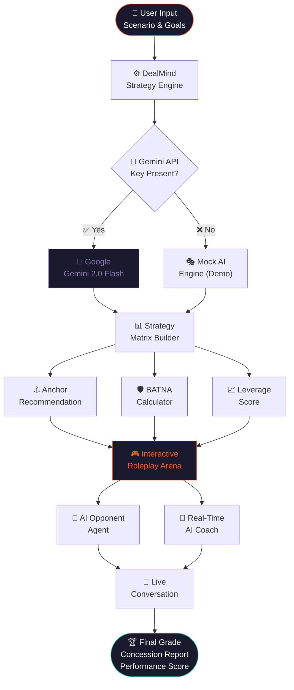
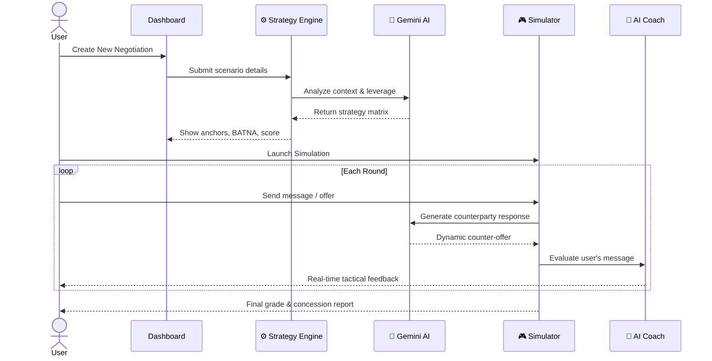

<div align="center">

```
╔══════════════════════════════════════════════════════════════════════╗
║                                                                      ║
║    ██████╗ ███████╗ █████╗ ██╗     ███╗   ███╗██╗███╗   ██╗██████╗  ║
║    ██╔══██╗██╔════╝██╔══██╗██║     ████╗ ████║██║████╗  ██║██╔══██╗ ║
║    ██║  ██║█████╗  ███████║██║     ██╔████╔██║██║██╔██╗ ██║██║  ██║ ║
║    ██║  ██║██╔══╝  ██╔══██║██║     ██║╚██╔╝██║██║██║╚██╗██║██║  ██║ ║
║    ██████╔╝███████╗██║  ██║███████╗██║ ╚═╝ ██║██║██║ ╚████║██████╔╝ ║
║    ╚═════╝ ╚══════╝╚═╝  ╚═╝╚══════╝╚═╝     ╚═╝╚═╝╚═╝  ╚═══╝╚═════╝  ║
║                                                                      ║
║            AI Negotiation Strategist & Simulator v2.0               ║
╚══════════════════════════════════════════════════════════════════════╝
```

<p align="center">
  <strong>Master high-stakes negotiations before they happen.</strong><br/>
  Roleplay against adaptive AI counterparties with live tactical coaching,<br/>
  anchor recommendations, and real-time concession tracking.
</p>

<br/>

[](https://react.dev/)
[](https://www.typescriptlang.org/)
[](https://vitejs.dev/)
[](https://ai.google.dev/)
[](https://www.framer.com/motion/)
[](LICENSE)

<br/>

[🚀 Features](#-key-features) •
[🏗️ Architecture](#-system-architecture) •
[⚡ Quick Start](#-quick-start) •
[🎯 Scenarios](#-practice-scenarios) •
[⚙️ Configuration](#-configuration)

</div>

---

## 🌟 What is DealMind?

Negotiating a **salary hike**, **apartment lease**, **freelance rate**, or **enterprise contract** is stressful without preparation. Most people concede too early, anchor too low, or crumble under pressure.

**DealMind** bridges that gap. It combines **game theory**, **BATNA calculations**, and **Google Gemini 2.0 Flash** into a private, immersive preparation platform that works entirely in your browser.

```
                     ┌─────────────────────────────────────────┐
                     │         THE DEALMIND ADVANTAGE          │
                     ├──────────────────┬──────────────────────┤
                     │  BEFORE          │  WITH DEALMIND        │
                     ├──────────────────┼──────────────────────┤
                     │  Gut feeling     │  Data-backed strategy │
                     │  Guess anchors   │  AI-optimized anchors │
                     │  No BATNA        │  Quantified walk-away │
                     │  Unprepared      │  Pre-simulated rounds │
                     │  Single approach │  4 AI persona styles  │
                     └──────────────────┴──────────────────────┘
```

---

## 🚀 Key Features

| Feature | What it does |
| :--- | :--- |
| 🎯 **Strategy Engine** | Calculates opening anchors, target numbers, walk-away limits, and acceptance probabilities using game theory. |
| 🎭 **Simulation Arena** | Live AI roleplay with realistic counter-offers, emotional pushbacks, and tactical trade-offs. |
| 🧠 **Real-Time Coach** | Micro-coaching on every move — flags premature concessions, BATNA deviation, and emotional phrasing. |
| ⚡ **1-Click Presets** | Ready-to-run scenarios for Salary, Rent, Freelance, and Enterprise SaaS negotiations. |
| 📊 **Analytics Dashboard** | Tracks historical performance, concession frequency, leverage scores, and target achievement. |
| 🔒 **100% Private** | All keys and data stay in your browser's `localStorage` — nothing leaves your device. |

---

## 🏗️ System Architecture



---

## 🔄 User Flow



---

## 🎯 Practice Scenarios

```
  ┌─────────────────────────────────────────────────────────────────────┐
  │                    BUILT-IN NEGOTIATION SCENARIOS                   │
  ├──────┬──────────────────────────────┬──────────────┬───────────────┤
  │  💼  │ Senior Software Engineer     │ Target       │ ₹10.0 LPA     │
  │      │ vs. HR Talent Partner        │ Walk-away    │ ₹9.0 LPA      │
  │      │                              │ Difficulty   │ 🟡 Intermediate│
  ├──────┼──────────────────────────────┼──────────────┼───────────────┤
  │  🏠  │ Apartment Lease Renewal      │ Target       │ ₹28,000/mo    │
  │      │ vs. Property Landlord        │ Walk-away    │ ₹32,000/mo    │
  │      │                              │ Difficulty   │ 🟢 Beginner    │
  ├──────┼──────────────────────────────┼──────────────┼───────────────┤
  │  💻  │ High-Ticket Freelance        │ Target       │ ₹80,000/mo    │
  │      │ vs. Startup Founder          │ Walk-away    │ ₹65,000/mo    │
  │      │                              │ Difficulty   │ 🔴 Advanced    │
  ├──────┼──────────────────────────────┼──────────────┼───────────────┤
  │  🏢  │ Enterprise SaaS Contract     │ Target       │ ₹90,000/yr    │
  │      │ vs. VP of Procurement        │ Walk-away    │ ₹105,000/yr   │
  │      │                              │ Difficulty   │ 🔴 Advanced    │
  └──────┴──────────────────────────────┴──────────────┴───────────────┘
```

---

## 🤖 AI Persona Styles

The AI counterparty can be calibrated to one of four negotiation temperaments:

```
  ┌─────────────────┐  ┌─────────────────┐  ┌─────────────────┐  ┌─────────────────┐
  │  🤝 COLLABORATIVE│  │  💼 PROFESSIONAL │  │  🛡️ FIRM        │  │  ⚔️ AGGRESSIVE  │
  │─────────────────│  │─────────────────│  │─────────────────│  │─────────────────│
  │ Seeks win-win   │  │ Data-driven      │  │ Holds position  │  │ Anchors high    │
  │ Makes concessions│  │ Formal tone     │  │ Minimal give    │  │ Creates urgency │
  │ Best for: Trust │  │ Best for: Corp  │  │ Best for: BATNA │  │ Best for: Stress│
  └─────────────────┘  └─────────────────┘  └─────────────────┘  └─────────────────┘
```

---

## 📁 Project Structure

```
DealMind-/
├── 📂 src/
│   ├── 📂 contexts/
│   │   ├── AuthContext.tsx          # Auth + Demo mode
│   │   └── NegotiationContext.tsx   # Global negotiations state
│   │
│   ├── 📂 layouts/
│   │   ├── AppLayout.tsx            # Sidebar + navigation shell
│   │   └── AppLayout.css
│   │
│   ├── 📂 pages/
│   │   ├── Landing.tsx              # Public homepage (Hanzo design)
│   │   ├── Dashboard.tsx            # Command center with hero + stats
│   │   ├── NewNegotiation.tsx       # Multi-step scenario builder
│   │   ├── StrategyPage.tsx         # AI-generated strategy output
│   │   ├── SimulatorHub.tsx         # Practice scenario selector
│   │   ├── Simulator.tsx            # Live chat + AI coach
│   │   ├── History.tsx              # Negotiation archive
│   │   ├── Insights.tsx             # Analytics + charts
│   │   └── Settings.tsx             # API key + preferences
│   │
│   ├── 📂 services/
│   │   └── aiService.ts             # Gemini API client
│   │
│   ├── 📂 data/
│   │   └── mockData.ts              # Demo scenarios + mock analysis
│   │
│   └── index.css                    # Global design tokens (Hanzo theme)
│
├── index.html
├── vite.config.ts
├── tsconfig.json
└── package.json
```

---

## ⚡ Quick Start

### 1. Clone & Install

```bash
# Clone the repository
git clone https://github.com/Aryan-Lade/DealMind-.git

# Navigate into the project directory
cd DealMind-

# Install dependencies
npm install
```

### 2. Start Development Server

```bash
npm run dev
```

Visit [`http://localhost:5173/`](http://localhost:5173/) in your browser.

> **No API key needed to explore!** Click **Try Demo** on the landing page to access all features instantly with realistic mock data.

---

## ⚙️ Configuration

DealMind works **out of the box in Demo Mode** — zero setup required.

To enable live Google Gemini AI:

### Option A — In-App Settings *(Recommended)*

```
  App → Settings → Paste Gemini API Key → Test Connection → Save
```

Get your free key at [Google AI Studio →](https://aistudio.google.com/app/apikey)

### Option B — Environment Variable

```bash
cp .env.example .env
```

```env
# .env

# --- Railway PostgreSQL Database ---
DATABASE_PUBLIC_URL=postgresql://${{PGUSER}}:${{PGPASSWORD}}@${{RAILWAY_TCP_PROXY_DOMAIN}}:${{RAILWAY_TCP_PROXY_PORT}}/${{PGDATABASE}}

# --- Optional Gemini API Key ---
VITE_GEMINI_API_KEY=your_gemini_api_key_here
```

---

## 🛠️ Tech Stack

| Layer | Technology |
| :--- | :--- |
| **Framework** | React 19 + TypeScript |
| **Database** | PostgreSQL (Railway) with automatic SSL connection |
| **Backend API** | Node.js + Express 5 (`pg`, `bcryptjs`, `jsonwebtoken`) |
| **Build Tool** | Vite 8 |
| **Styling** | Vanilla CSS with custom design tokens |
| **Animations** | Framer Motion 13 |
| **AI Engine** | Google Gemini 2.0 Flash |
| **Charts** | Recharts |
| **Icons** | Lucide React |
| **Routing** | React Router v7 |

---

## 📦 Production Build

```bash
npm run build
npm run preview
```

---
