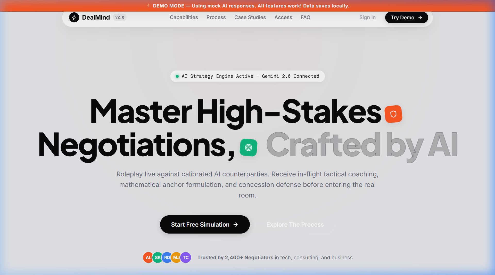
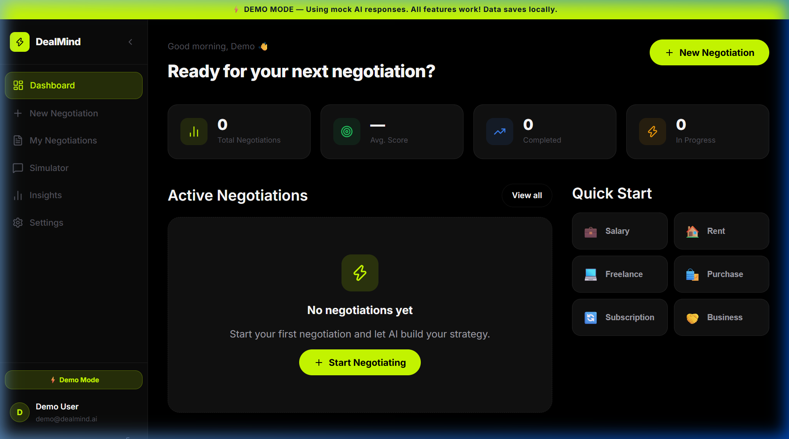
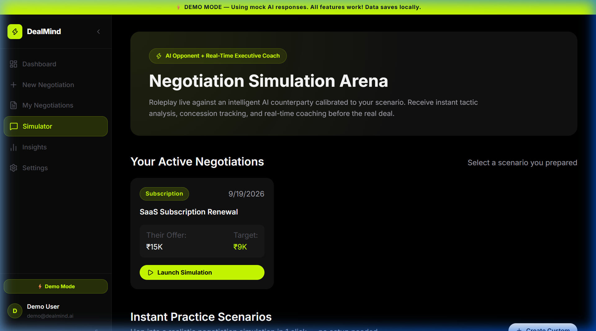
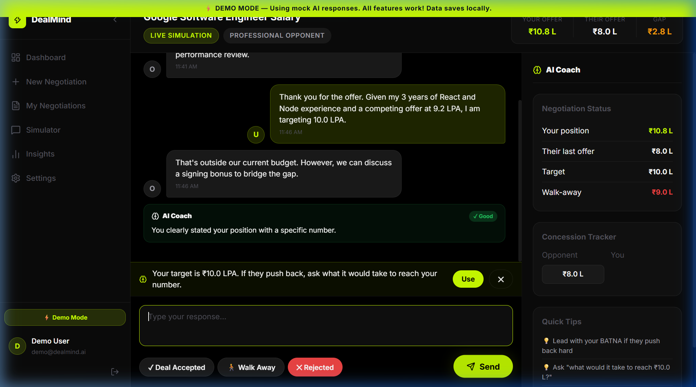
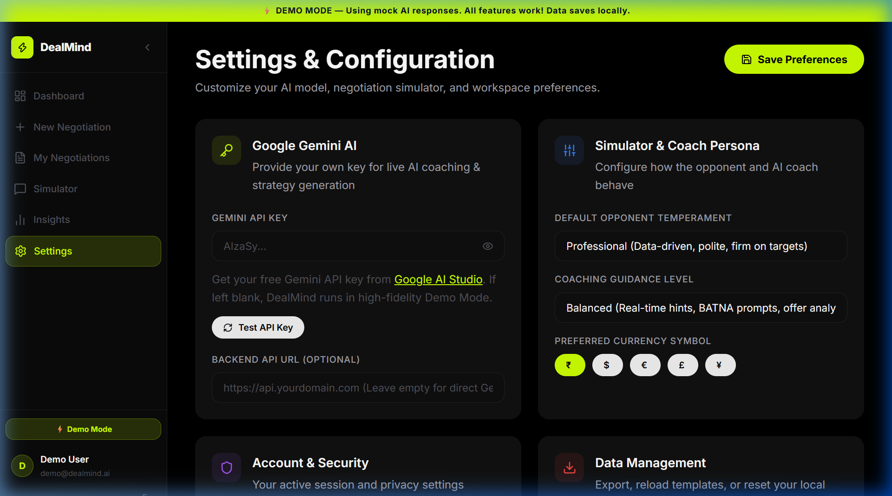
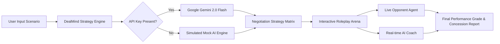

<div align="center">

# ⚡ DealMind — AI Negotiation Strategist & Simulator

<p align="center">
  <strong>Master high-stakes negotiations before they happen.</strong><br>
  Roleplay against adaptive AI counterparties with live tactical coaching, anchor recommendations, and concession tracking.
</p>

[](https://react.dev/)
[](https://www.typescriptlang.org/)
[](https://vitejs.dev/)
[](https://ai.google.dev/)
[](LICENSE)

<br/>

<!-- Hero Screenshot -->


<br/><br/>

[🚀 Key Features](#-key-features) •
[📸 Visual Walkthrough](#-visual-walkthrough) •
[🏗️ Architecture](#-system-architecture) •
[⚡ Quick Start](#-quick-start) •
[⚙️ Configuration](#-configuration)

</div>

---

## 🌟 What is DealMind?

Negotiating a **salary hike**, **apartment lease renewal**, **freelance project rate**, or **enterprise vendor contract** is intimidating without preparation. Most people concede too early or fail to anchor their numbers effectively.

**DealMind** bridges that gap. It combines **game theory**, **BATNA calculations**, and **Google Gemini 2.0 Flash** into an immersive, private preparation platform:

- **Quantify Your Leverage**: Understand your true bargaining power before entering discussions.
- **Roleplay with AI**: Converse with counterparty personas (Professional, Collaborative, Firm, Aggressive).
- **In-Flight AI Coaching**: Receive instant alerts if you make premature concessions or emotional statements.
- **Zero Friction**: Practice immediately in **Demo Mode** or plug in your personal Gemini API key.

---

## 🚀 Key Features

| Feature | Description |
| :--- | :--- |
| 🎯 **Strategy Engine** | Calculates opening anchors, target numbers, walk-away boundaries, and acceptance probabilities. |
| 🎭 **Simulation Arena** | Live conversation simulator simulating realistic counter-offers, pushbacks, and tactical trade-offs. |
| 🧠 **Real-Time Executive Coach** | Micro-coaching on every move: identifies early concessions, BATNA references, and anchor adherence. |
| ⚡ **1-Click Practice Scenarios** | Ready-to-run presets for Salary, Apartment Lease, High-Ticket Retainers, and SaaS Contracts. |
| 📊 **Analytics & Scoring** | Tracks historical performance grades, concession frequency, and target achievement percentages. |
| 🔒 **100% Client-Side Privacy** | API keys and negotiation data remain stored securely in your browser's `localStorage`. |

---

## 📸 Visual Walkthrough

### 1. 🎛️ Negotiation Command Center
View your preparation readiness, historical performance scores, and ongoing negotiations in one sleek dashboard.



---

### 2. ⚡ Practice Arena & Instant Presets
Jump into curated roleplay simulations in 1 click without manual configuration, or select from your active custom negotiations.



---

### 3. 💬 Live Simulation with Real-Time AI Coaching
Roleplay against dynamic AI counterparties. On every message, the AI Coach assesses your tactics, warns against premature concessions, and gives recommended next steps.



---

### 4. ⚙️ AI Settings & Live Key Verification
Directly input your **Google Gemini API Key** and verify live connectivity with Gemini 2.0 Flash in real time. Adjust counterparty temperament, coaching aggressiveness, and currency preferences.



---

## 🏗️ System Architecture



---

## ⚡ Quick Start

### 1. Clone & Install
```bash
# Clone the repository
git clone https://github.com/Aryan-Lade/DealMind-.git

# Navigate into the project directory
cd DealMind-

# Install dependencies
npm install
```

### 2. Start Development Server
```bash
npm run dev
```

Visit [`http://localhost:5173/`](http://localhost:5173/) in your browser.

---

## ⚙️ Configuration

DealMind works completely out of the box in **Demo Mode** with realistic offline mock data.

To enable live Google Gemini AI generation:

### Option A: In-App Settings (Recommended)
1. Launch the app and navigate to **Settings** (`/settings`).
2. Paste your API key from [Google AI Studio](https://aistudio.google.com/app/apikey).
3. Click **Test API Key** to verify connection, then click **Save Preferences**.

### Option B: Environment Variables
Copy `.env.example` to `.env`:
```bash
cp .env.example .env
```
And add your Gemini key:
```env
VITE_GEMINI_API_KEY=your_gemini_api_key_here
```

---

## 🎯 Included Practice Scenarios

| Scenario | Opponent Role | Target | Walk-Away | Difficulty |
| :--- | :--- | :--- | :--- | :--- |
| 💼 **Senior Software Engineer** | HR Talent Partner | ₹10.0 LPA | ₹9.0 LPA | Intermediate |
| 🏠 **Apartment Lease Renewal** | Property Landlord | ₹28,000 | ₹32,000 | Beginner |
| 💻 **High-Ticket Freelance Retainer**| Startup Founder | ₹80,000 | ₹65,000 | Advanced |
| 🏢 **Enterprise SaaS Procurement** | VP of Procurement | ₹90,000 | ₹105,000 | Advanced |

---

## 📦 Production Build

To produce an optimized production bundle:
```bash
npm run build
npm run preview
```

---

